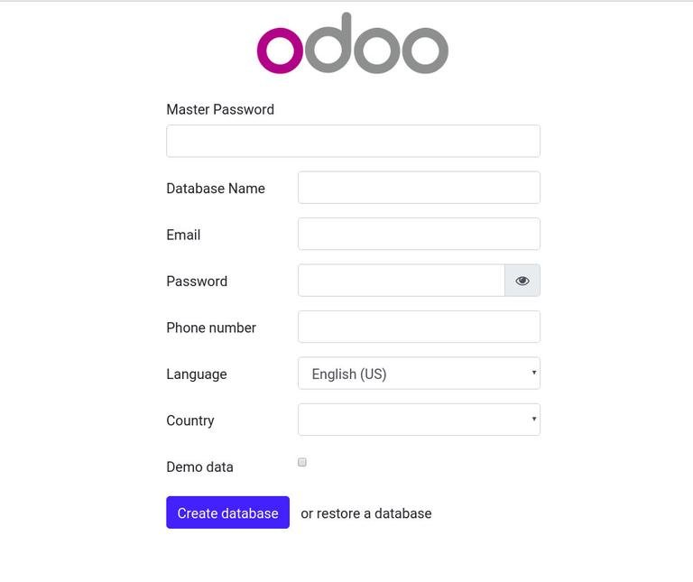

# Manuel d'installation d'Odoo-13 Odoo sur Ubuntu 18.04
Odoo est une suite d'applications d'entreprise open source populaire. Il offre une gamme d'applications, notamment CRM, commerce électronique, création de sites Web, facturation, comptabilité, fabrication, entrepôt, gestion de projet, inventaire et bien plus encore, le tout parfaitement intégré.

Odoo peut être installé de plusieurs manières selon le cas d'utilisation et les technologies disponibles. Le moyen le plus simple et le plus rapide d'installer Odoo consiste à utiliser les référentiels officiels Odoo APT.
## Installation des prérequis

Connectez-vous à votre Ubuntu en tant qu'utilisateur sudo et mettez à jour le cache Apt :

    sudo apt update

Installation de Git , Pip , Node.js , et des tools requise pour odoo et les dependence

    sudo apt install git python3-pip build-essential wget python3-dev python3-venv python3-wheel libxslt-dev libzip-dev libldap2-dev libsasl2-dev python3-setuptools node-less

## Creation des utilisateur du system
Créez un utilisateur système qui exécutera Odoo, nommé odoo13 avec le répertoire personnel /opt/odoo13:
    
    sudo useradd -m -d /opt/odoo13 -U -r -s /bin/bash odoo13
Vous pouvez définir le nom de l'utilisateur comme vous le souhaitez, tant que vous créez un utilisateur PostgreSQL avec le même nom.
Installation et configuration de PostgreSQL

Odoo utilise PostgreSQL comme back-end de la base de données. Pour installer PostgreSQL, exécutez la commande suivante:
    
    sudo apt install postgresql
Une fois l'installation terminée, créez un utilisateur PostgreSQL avec le même nom que l'utilisateur système précédemment créé, dans notre cas c'est odoo13
   
    sudo su - postgres -c "createuser -s odoo13"
Installation de Wkhtmltopdf

Le package wkhtmltox fournit un ensemble d'outils de ligne de commande open source qui peuvent rendre HTML en PDF et divers formats d'image. Pour pouvoir imprimer des rapports PDF, vous devez installer l'outil wkhtmltopdf. La version recommandée pour Odoo est 0.12.5, qui n'est pas disponible dans les référentiels Ubuntu 18.04 par défaut.

Téléchargez le package à l'aide de la commande wget suivante
    wget https://github.com/wkhtmltopdf/wkhtmltopdf/releases/download/0.12.5/wkhtmltox_0.12.5-1.bionic_amd64.deb
    sudo apt install ./wkhtmltox_0.12.5-1.bionic_amd64.deb
## Installer et configurer Odoo 13

Comme mentionné précédemment, nous installerons Odoo à partir de la source dans un environnement virtuel Python isolé.

Tout d'abord, passez à l'utilisateur "odoo13"

    sudo su - odoo13
    git clone https://www.github.com/odoo/odoo --depth 1 --branch 13.0 /opt/odoo13/odoo
    cd /opt/odoo13
    python3 -m venv odoo-venv
ACTIVERl'environnement virtuel

    source odoo-venv/bin/activate
Installez tous les modules Python requis avec pip3:

    pip3 install wheel
    pip3 install -r odoo/requirements.txt
    deactivate

    mkdir /opt/odoo13/odoo-custom-addons
    exit
## creation des fichier de conf

    sudo nano /etc/odoo13.conf
## saisissez

    [options]
    ; This is the password that allows database operations:
    admin_passwd = my_admin_passwd
    db_host = False
    db_port = False
    db_user = odoo13
    db_password = False
    addons_path = /opt/odoo13/odoo/addons,/opt/odoo13/odoo-custom-addons
## Création d'un fichier d'unité Systemd

    sudo nano /etc/systemd/system/odoo13.service
## saisissez

    [Unit]
    Description=Odoo13
    Requires=postgresql.service
    After=network.target postgresql.service
    
    [Service]
    Type=simple
    SyslogIdentifier=odoo13
    PermissionsStartOnly=true
    User=odoo13
    Group=odoo13
    ExecStart=/opt/odoo13/odoo-venv/bin/python3 /opt/odoo13/odoo/odoo-bin -c /etc/odoo13.conf
    StandardOutput=journal+console
    
    [Install]
    WantedBy=multi-user.target
## redemerage

    sudo systemctl daemon-reload

    sudo systemctl enable --now odoo13

Verifier le status du service 

    sudo systemctl status odoo13
output

    ● odoo13.service
       Loaded: loaded (/etc/systemd/system/odoo13.service; enabled; vendor preset: enabled)
       Active: active (running) since Sat 2019-10-19 20:06:23 UTC; 3s ago
     Main PID: 1860 (python3)
        Tasks: 4 (limit: 2362)
       CGroup: /system.slice/odoo13.service
               └─1860 /opt/odoo13/odoo-venv/bin/python3 /opt/odoo13/odoo/odoo-bin -c /etc/odoo13.conf

Ouvrez votre navigateur et tapez : http://<votre_domaine_ou_adresse_IP>:8069

En supposant que l'installation soit réussie, un écran similaire au suivant apparaître
Installer Odoo 13 sur Ubuntu

