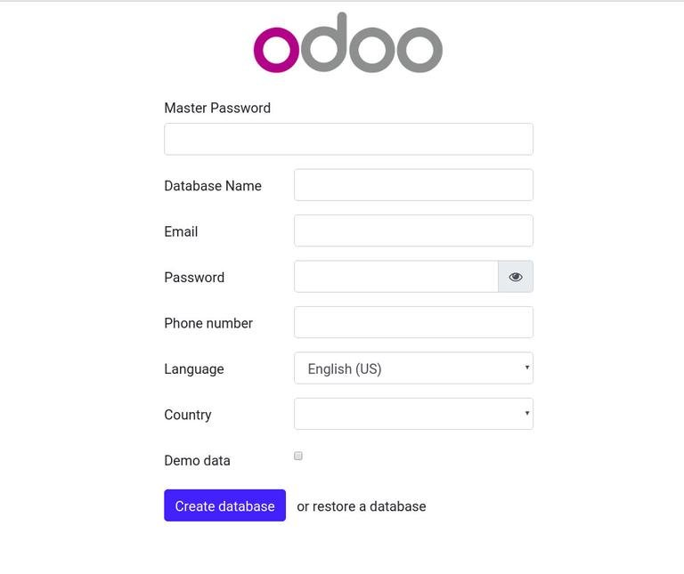

# Manuel d'installation d'Odoo-8

Avant mai 2014, Odoo s’appelait Open ERP. C’est l’ERP open source le plus téléchargé au monde. Son éditeur, Odoo SA,
est une belle entreprise en forte croissance comptant déjà 250 salariés parmi ses rangs. 
Son siège est situé à Bruxelles (Belgique) mais son rayonnement est mondial : 550 partenaires à travers le monde 
proposent Odoo à leurs clients.

Je vais vous montrer dans ce manuel comment installer Odoo à partir des sources sur un serveur Ubuntu 14.04 (LTS).
La procédure est sensiblement la même avec Ubuntu 14.10.

J’ai testé et approuvée cette installation sur un → VPS Digital Contabo. 
# Paquets

Avant d’installer Odoo, on va installer plusieurs paquets au niveau du système :

    Virtualenv pour cloisonner l’environnement Python dans lequel s’exécutera le serveur Odoo ;
    Supervisor pour superviser ledit serveur Odoo ;
    PostgreSQL pour héberger la base de données d’Odoo ;
    Nginx pour protéger le serveur Odoo derrière un proxy HTTP ;
    git pour rappatrier les sources d’Odoo directement du github du projet ;
    gcc pour compiler certaines des dépendances python requises à l’installation d’Odoo ;
    et plusieurs entêtes de développement requises pour ces compilations.
En un one-liner, ça donne : 

## installation de quelques paquet

    sudo apt-get install --no-install-recommends python-setuptools python-virtualenv python-pip supervisor postgresql nginx git build-essential gcc python-dev postgresql-server-dev-9.3 libxml2-dev libxslt1-dev libjpeg62-dev libldap2-dev libsasl2-dev libssl-dev
    # Changez postgresql-server-dev-9.3 en postgresql-server-dev-9.4 si vous êtes sur une Ubuntu 14.10.
## On va ensuite créer un utilisateur système dédié à Odoo :
     sudo adduser --system --home=/opt/odoo --group odoo
## Installation des sources d’Odoo
Lorsque l’on travaille sur plusieurs projets Python en même temps, il arrive que l’on utilise des versions de Python différentes
ou que l’on ait besoin d’une version particulière d’une biliothèque. Il est donc important d’utiliser un environnement dédié à
chaque projet. C’est ce que nous permet VirtualEnv.
    
    sudo su - odoo -s /bin/bash
    cd ~
    virtualenv venv-odoo
    source venv-odoo/bin/activate
    git clone https://www.github.com/odoo/odoo --depth 1 --branch 8.0 --single-branch
    pip install -r odoo/requirements.txt
Pour Ubuntu 14.10, remplacez la commande virtualenv venv-odoo par python /usr/lib/python2.7/dist-packages/virtualenv.py venv-odoo
## Rajout de modules tiers
    mkdir odoo_community; cd odoo_community
    mkdir addons-{available,enabled}
    cd addons-available
    git clone --depth 1 --branch 8.0 --single-branch https://github.com/OCA/server-tools.git
    cd ../addons-enabled
    ln -s ../addons-available/server-tools/disable_openerp_online/
    ln -s ../addons-available/server-tools/cron_run_manually/
## Creation de l'addons pour vos propre contenir vos propres modules
    cd ~
    mkdir -p odoo_dev/addons-{available,enabled}
## Création de la base de données PostgreSQL

    sudo su - postgres
    createdb odoo
    createuser --pwprompt odoo
    > amazingodoo
    psql
    > grant all privileges on database odoo to odoo;
## Configuration d’Odoo

    sudo su - odoo -s /bin/bash

On crée le fichier odoo-server.conf :

    [options]
    ; This is the password that allows database operations:
    admin_passwd = odoopassword
    db_host = localhost 
    db_port = 5432
    db_name = odoo
    db_user = odoo
    db_password = odoopassword
    addons_path = /opt/odoo/odoo/addons,/opt/odoo/odoo_community/addons-enabled,/opt/odoo/odoo_dev/addons-enabled
    max_cron_threads = 1
    xmlrpc_interface = 127.0.0.1
    netrpc_interface = 127.0.0.1
    ; logfile = /opt/odoo/odoo-server.log
    # xmlrpc_port = port souhaiter 
    # par defaut le port est 8069 pour plus de securité veuillez le changez
Fichier dont on restreint les droits d’accès :

    chmod 600 odoo-server.conf

Lançons maintenant le serveur Odoo pour voir si tout fonctionne :

    source venv-odoo/bin/activate
    python odoo/openerp-server -c odoo-server.conf

Pas d’erreur ? Ctrl-C pour arrêter le serveur.
## Sécurisation d’Odoo
Supervisor

On utilise Supervisor pour s’assurer que Odoo redémarre en cas de plantage. On a deux processus à surveiller : openerp-server (serveur Odoo) et openerp-gevent (serveur Odoo dédié aux requêtes long-polling).

    sudo su
    cd /etc/supervisor/conf.d/

On crée d’abord le fichier odoo-server.conf :

    [program:odoo-server]
    command=/opt/odoo/venv-odoo/bin/python /opt/odoo/odoo/openerp-server -c /opt/odoo/odoo-server.conf --logfile=/opt/odoo/odoo-server.log
    autostart=true
    autorestart=true
    killasgroup=true
    user=odoo
    redirect_stderr=true
    directory=/opt/odoo/odoo
    environment = HOME="/opt/odoo/",USER="odoo"

Puis on crée le fichier odoo-server-longpolling.conf :
    
    [program:odoo-server-longpolling]
    command=/opt/odoo/venv-odoo/bin/python /opt/odoo/odoo/openerp-gevent -c /opt/odoo/odoo-server.conf --logfile=/opt/odoo/odoo-server-longpolling.log
    autostart=true
    autorestart=true
    killasgroup=true
    user=odoo
    redirect_stderr=true
    directory=/opt/odoo/odoo
    environment = HOME="/opt/odoo/",USER="odoo"
## prendre en compte des modification et redemare le server odoo
    
    supervisorctl reread
    supervisorctl update
    supervisorctl restart odoo-server && supervisorctl restart odoo-server-longpolling
## Nginx
On va placer Odoo derrière un Reverse Proxy HTTP.

On va commencer par désinstaller Apache :

    apt-get remove apache2 -y

Puis on va configurer notre hôte :

    cd /etc/nginx/sites-available/
    nano odoo.conf
## saisissez

    server {
        listen        80;
        #server_name   odoo.com;
        access_log    /var/log/nginx/odoo.access.log;
        error_log     /var/log/nginx/odoo.error.log;
    
        location / {
            proxy_pass http://127.0.0.1:8069;
            proxy_next_upstream error timeout invalid_header http_500 http_502 http_503 http_504;
            proxy_redirect off;
        proxy_connect_timeout       600;
        proxy_send_timeout          600;
        proxy_read_timeout          600;
        send_timeout                600;
        charset utf-8;
            
        # increase proxy buffer to handle some OpenERP web requests
        proxy_buffers 16 64k;
        proxy_buffer_size 128k;
        client_max_body_size 100m;
    
            proxy_set_header    Host                $host;
            proxy_set_header    X-Real-IP           $remote_addr;
            proxy_set_header    X-Forwarded-For     $proxy_add_x_forwarded_for;
        proxy_set_header    X-Forwarded-Proto   $scheme;
        }
    
        location /longpolling {
        proxy_pass http://127.0.0.1:8072;
        }
    
        location ~* /web/static/ {
            proxy_cache_valid 200 60m;
            proxy_buffering on;
            expires 864000;
            proxy_pass http://127.0.0.1:8069;
        }
    }

    cd /etc/nginx/sites-enabled
    rm defaut
    ln -s ../sites-available/odoo.conf
    service nginx configtest
    service nginx restart
## Mise en route d’Odoo
Création de la première base Odoo

Pointez votre navigateur à l’adresse http://localhost/ ou si c'est sur un serveur en lignehttp://<votre_domaine_ou_adresse_IP>:8069 
Vous serez redirigé vers le Database Manager et invité à créer votre première base Odoo.

Le master password est celui que l’on a défini dans odoo-server.conf. Le password sera celui de 
l’administrateur de cette nouvelle base.

Une fois la base créée, connectez-vous y en tant qu’administrateur, en tappant admin dans le champ Email.

